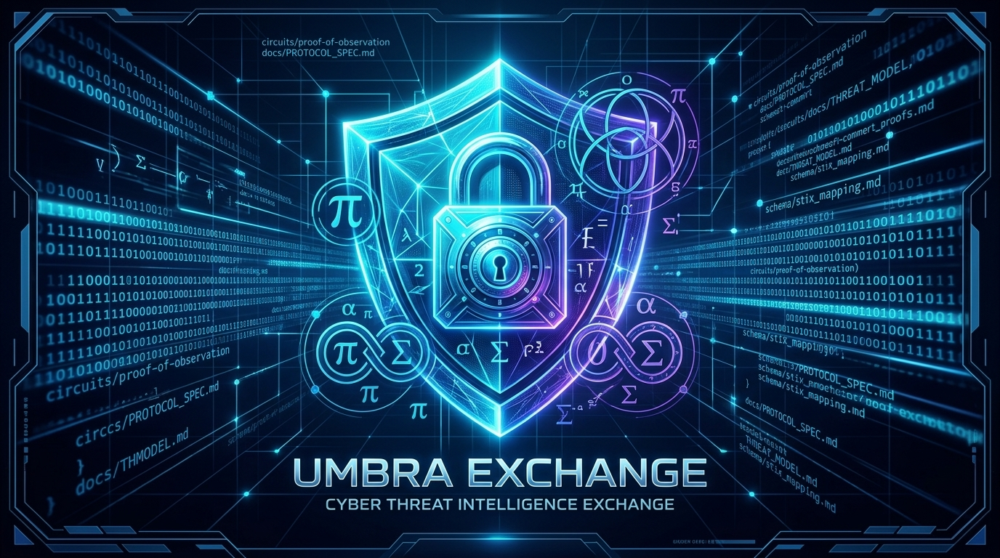

# Umbra Exchange



**A zero-knowledge threat-intelligence exchange protocol.**  
Prove what you've seen, without showing what you've got.

> **Status:** Early scaffold / research-stage (Phase 0). Not production-ready. Contributions and critique welcome.

## The problem

Threat-intel sharing today runs on trust in a hub. MISP, OpenCTI, ISAC feeds — they all work the same way: you send your raw indicators (IOCs) to a shared instance, and everyone who has access to that instance sees exactly what you saw, when, and (often) who you are.

That's fine for large orgs with legal teams and NDAs. It's a non-starter for:

- small SOCs and independent researchers who don't want to leak their proprietary telemetry to a shared pool
- fraud/OSINT teams whose "blocklist" *is* the business asset
- anyone who wants to contribute to collective defense without becoming a data source for their competitors, or a target once their detection capability is public

The result: most organizations under-share. Collective defense stays weaker than it could be, because the sharing model demands more trust than most participants are willing to extend.

## The idea

Umbra Exchange lets a participant prove statements about their threat telemetry **without revealing the telemetry itself**:

1. **Proof of observation** — "I observed this IOC" without revealing the rest of your feed, using a Merkle-inclusion zk-SNARK. The verifier learns the IOC was seen by *someone with a valid credential*, nothing else.

2. **Anonymous contributor tiering** — a credential (think: anonymous membership proof) that lets you prove "I'm a tier-3 trusted contributor" without linking submissions to your identity across time. This is what keeps the system Sybil-resistant without doxxing anyone.

3. **Private set intersection for blocklists** — check whether an indicator is in someone else's private list without either party revealing their full list to the other.

4. **Aggregate reputation scoring** — a confidence score per IOC, computed from multiple anonymous contributions, without exposing who submitted what.

5. **STIX 2.1 / MISP-compatible I/O** — so existing SOC tooling can consume Umbra output without changing their stack.

## Why this doesn't already exist

There's real academic groundwork — SeCTIS (blockchain + swarm learning), the OPTIMA project, various ZKP-for-digital-identity papers — but nothing that ships as a usable, self-hostable, open-source tool wired for the formats SOC teams actually use (STIX/MISP).

The gap isn't the cryptography — Merkle-inclusion SNARKs and PSI are well-understood primitives — it's that nobody has packaged them for this specific, unglamorous use case and given it away.

## Relationship to Veritas Mesh

The proof engine here is built on the same foundations as [Veritas Mesh](#) (Groth16 over BN254, arkworks) rather than starting from scratch.

Umbra Exchange is the threat-intel-specific application layer; Veritas Mesh remains the general-purpose compliance/commitment proof engine.

## Repository layout

```text
umbra-exchange/
├── docs/
│   ├── ARCHITECTURE.md       # system design, components, data flow
│   ├── PROTOCOL_SPEC.md      # the actual protocol: message formats, proof statements
│   └── THREAT_MODEL.md       # what this protects against, what it doesn't
├── circuits/                 # Rust workspace, arkworks-based ZK circuits
│   └── crates/
│       ├── proof-of-observation/
│       └── reputation-accumulator/
├── schema/                   # STIX 2.1 / MISP interop mappings
└── scripts/
```

## Status honestly

This is Phase 0.

`reputation-accumulator` is implemented and tested:

```bash
cargo test -p reputation-accumulator
```

**7/7 passing.**

`proof-of-observation`'s circuit skeleton compiles against real arkworks 0.4 crates, but the actual constraints are still TODO:

- Merkle path
- Poseidon leaf hashing
- credential gadget
- nullifier

See [`docs/ARCHITECTURE.md`](docs/ARCHITECTURE.md) for the exact breakdown and [`docs/BUILD_NOTES.md`](docs/BUILD_NOTES.md) for toolchain notes.

> **Nothing here has been audited. Treat it as a research prototype until this notice is removed.**

## License

Apache-2.0. See [`LICENSE`](LICENSE).

## Contributing / support

Issues and PRs welcome — this is meant to be built in the open.

See [`CONTRIBUTING.md`](CONTRIBUTING.md).